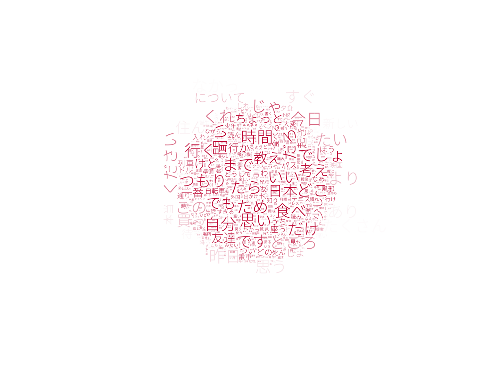

# Tensorflow EN - JA Machine Translation based Seq2seq

Most of code in this notebook is based on tensorflow tutorial on their website, you can find it [here](https://www.tensorflow.org/addons/tutorials/networks_seq2seq_nmt).

If you like it you can upvote my kaggle kernel here : [Machine Translation EN - JP Seq2seq TF](https://www.kaggle.com/wahyusetianto/machine-translation-en-jp-seq2seq-tf)